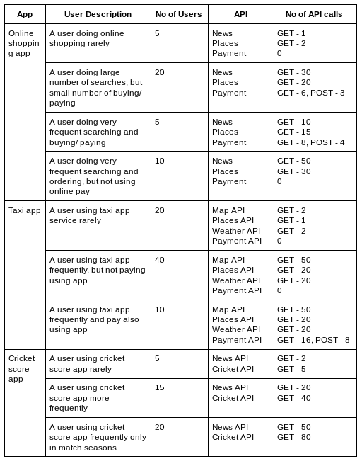

# Introduction

## What is WSO2 API Manager?

WSO2 API Manager is a full life-cycle API Management solution which has an API Gateway and a Microgateway. See more on https://wso2.com/api-management/

## What is APIM Traffic Tool?
APIM Traffic Tool allows you to simulate a real world traffic on WSO2 API Manager. This tool is not just a simple request sender, but it also allows you to setup a user scenario in WSO2 API Manager and generate a set of tokens to invoke APIs. Tool is consisting of two main components traffic tool and attack tool. Traffic tool will simulate a real world traffic pattern while attack tool will simulate a given attack on WSO2 API Manager. APIM Traffic Tool can also be used to generate an API invoking traffic dataset and attack dataset for Machine Learning purposes.

## How does APIM Traffic Tool Works?
Tool will allow user to create a set of APIs and Applications in WSO2 API Manager according to a given scenario. Also the tool will signup a set of users in WSO2 carbon and set them with subscriber privileges. These user details are generated randomly by the tool. The users should be distributed among applications according to a scenario and traffic tool will generate access tokens for each user-application combination using the password grant type ([see more](https://docs.wso2.com/display/AM260/Password+Grant)).

The traffic tool will continuously send traffic to the WSO2 API Manager throughout a user specified time according to the given pattern.

The attack tool will attack WSO2 API Manager throughout a user specified time. Attack tool is capable of simulating following attack types.

###### 1. DOS Attack
###### 2. DDOS Attack
###### 3. Abnormal token usage attack
###### 4. Extreme delete attack
###### 5. Stolen token attack

# Quick Start Guide

## Prerequisites
1. Install Java 7 or 8 (https://www.oracle.com/technetwork/java/javase/downloads/index.html).

2. Download and install WSO2 API Manager version 2.6.0 (https://wso2.com/api-management/).

3. Install Python 3.6 or higher.

4. Install pip version 3 if not already installed.

5. Install required python packages by running the following command in the project home directory.
   - `$ pip install -r requirement.txt`

6. Download and install Apache jmeter version 5.1.1 or higher. Jmeter will only be used by the attack tool. If you're only using the traffic-tool script, no need to install jmeter. (http://jmeter.apache.org/download_jmeter.cgi).

7. Add following two packages to the `<JMETER_HOME>/lib` folder.
   - Download and add Apache ivy jar file (https://ant.apache.org/ivy/download.cgi)
   - Add attack tool helper package (can be found from `<TOOL_HOME>/resources/add-on/attack-tool-helpers.jar`)

8. Download a IP Geo-location Database from https://www.ipinfodb.com/free-database and add it to `<TOOL_HOME>/resources/libraries/` directory. Include name of the added file in `<TOOL_HOME>/config/user-settings.yaml` file in front of `ip_database` under `resources` (include name with the csv file extension). Make sure the column order of the database schema matches with the column order in `user-settings.yaml` file.
> Above link contains two types of datasets "Free IP Geo-location Databases" and "Free IP Proxy Databases". Please download a IP Geo-location dataset.

9. By default, access tokens get expired after 60 minutes time interval. If you are planning to simulate a traffic for more than 1 hour duration, please configure WSO2 API Manager and APIM Traffic Tool as below.
   - Set the value of `<UserAccessTokenDefaultValidityPeriod>` element in the `<APIM_HOME>/repository/conf/identity/identity.xml` file as appropriate. It is recommended to set user access token validity period to at least `36000` for testing environments ([more on access tokens](https://docs.wso2.com/display/AM260/Working+with+Access+Tokens)).
   - Set the value of `token_validity_period` as appropriate in the `<TOOL_HOME>/config/traffic-tool.yaml` file. It is recommended to set `token_validity_period` to `-1` for testing environments.

10. Verify that all configurations are set for the traffic and attack scripts as mentioned below.

## Configuring the Tool
Some of the default configurations for WSO2 API Manager and default scenario are given in all the config files. If you are running WSO2 API Manager on different configurations or using the tool for a custom scenario, you can change the tool configurations as stated below. All configuration files are in the `<TOOL_HOME>/config` folder. Advanced configuration options are listed in a later section of the document.

1. Add your jmeter path in the `<TOOL_HOME>/config/user-settings.yaml` file under `path_variables`.

2. Enter correct API Manager version (please state as `2.6`, `3.0`, etc), endpoints, protocol type, host ip and ports of WSO2 API Manager in the `<TOOL_HOME>/config/apim.yaml` file (Default ports and details can be found at https://docs.wso2.com/display/AM260/Default+Product+Ports).

   ```
   Default Endpoints for WSO2 API Manager 2.6.0

   token_registration_endpoint: /client-registration/v0.14/register
   token_endpoint: /token
   publisher_api: /api/am/publisher/v0.14/apis
   store_application: /api/am/store/v0.14/applications
   store_subscription: /api/am/store/v0.14/subscriptions
   user_signup: /store/site/blocks/user/sign-up/ajax/user-add.jag
   delete_user: /services/RemoteUserStoreManagerService.RemoteUserStoreManagerServiceHttpsSoap11Endpoint

   Default Endpoints for WSO2 API Manager 3.0.0

   token_registration_endpoint: /client-registration/v0.15/register
   token_endpoint: /token
   publisher_api: /api/am/publisher/v0.15/apis
   store_application: /api/am/store/v0.15/applications
   store_subscription: /api/am/store/v0.15/subscriptions
   user_signup: /api/identity/user/v1.0/me
   delete_user: /services/RemoteUserStoreManagerService.RemoteUserStoreManagerServiceHttpsSoap11Endpoint
   
   Default Endpoints for WSO2 API Manager 3.1.0
   
   token_registration_endpoint: /client-registration/v0.16/register
   token_endpoint: /token
   publisher_api: /api/am/publisher/v0.16/apis
   store_application: /api/am/store/v0.16/applications
   store_subscription: /api/am/store/v0.16/subscriptions
   user_signup: /api/identity/user/v1.0/me
   delete_user: /services/RemoteUserStoreManagerService.RemoteUserStoreManagerServiceHttpsSoap11Endpoint

3. Add details of each Application (name, description and api subscriptions) under apps section in `<TOOL_HOME>/config/apim.yaml` file. Provide `api_subscriptions` as comma (,) separated values.

   ```
   Example Usage

   apps:
    - name: Online Shopping
      description: This is an online shopping app
      api_subscriptions: News,Places,Payment

    - name: Taxi
      description: This is a taxi app
      api_subscriptions: Map,Places,Weather,Payment
   ```

4. Add details of each API (name, description, tags (specify in a list), context, version, resources) under apis section in `<TOOL_HOME>/config/api_details.yaml` file.

   ```
   Example Usage

   apis:
    - name: News
      description: This is an API which users can query by keywords topics publications
      tags: [news, info]
      context: news
      version: 1
      resources:
       - method: GET
         path: menu

    - name: Places
      description: Users can find popular places like food shops banks etc using this API
      tags: [places]
      context: places
      version: 1
      resources:
       - method: GET
         path: menu
   ```

5. Configure the `<TOOL_HOME>/config/traffic-tool.yaml` file as stated below (Configurations for the traffic script).
   - Modify **protocol**, **ip address** and **port** of the host under `api_host` section.
   - Specify number of users to be created in `no_of_users` field under `tool_config` section.

6. Configure the `<TOOL_HOME>/config/attack-tool.yaml` file as stated below (Configurations for the attack script).
   - Modify **protocol**,**ip address** and **port** of the host under `api_host` section.
   - Set the attack duration in seconds using `attack_duration`. (Note: For DOS and DDOS attacks, attack duration is defined per API)

 > It is recommended to add `setenv.sh` script in the `<TOOL_HOME>/resources/add-on` directory to the `<JMETER_HOME>/bin` directory in order to increase the heap size of the JMeter if you are simulating DOS or DDOS attacks with heavy concurrency.

7. Add swagger definitions for all APIs as separate json files in the `<TOOL_HOME>/data/swagger/` directory. FileName should be equal to `<api_name>.json` in lower case letters.

> Note that this is an optional step and swagger files will be generated by the tool if not provided.

## Using the Traffic Tool
To use the traffic tool run the following command with the desired argument in a command line inside the `<TOOL_HOME>/bin` folder. To list down available options and their command line arguments, just run the command with the flag `-h`.

`$ ./traffic-tool.sh argument`

```
$ ./traffic-tool.sh -h
Traffic Tool Options
setup: Setup scenario
start: Simulate traffic
stop : Stop traffic tool
gen  : Generate traffic data (without invoking)
clean: Cleanup scenario data in API Manager
adv  : View advanced options
```

#### 1. Setup the Tool and API Manager Environment
Run the below command to generate random user details, user-application invoke scenario, and then create APIs, applications, users in WSO2 API Manager and generate invoke tokens to consume resources.

`$ ./traffic-tool.sh setup`

#### 2. Simulate a Traffic on API Manager
Run the below command to simulate an API invoking traffic on WSO2 API Manager. You will be prompted for a filename and the script run time. Enter the filename without a file extension(without .txt, .csv, etc) and the output/ dataset will be saved in dataset/traffic/filename.csv directory. Traffic will be executed throughout the given time (Enter the time in minutes when prompted).

```
$ ./traffic-tool.sh start
Enter filename (without file extension):
output
Enter script execution time in minutes:
15
```

#### 3. Stop the Traffic Tool
Run the below command to stop the API invoking or data generation while the script is running.

`$ ./traffic-tool.sh stop`

#### 4. Generate the Traffic Dataset without Invoking
Run the below command to generate an API invoking traffic without actually invoking APIs. You will be prompted for a filename. Enter the filename without a file extension(without .txt, .csv, etc) and the output/ dataset will be saved in dataset/generated-traffic/filename.csv directory.

```
$ ./traffic-tool.sh gen
Enter filename (without file extension):
gen_traffic_data
```

#### 5. Remove Scenario from API Manager
Run the below command to remove all the created APIs, applications and users from WSO2 API Manager.

`$ ./traffic-tool.sh clean`

#### 6. Advanced Options
Traffic tool will provide some advanced options to allow more flexibility for the process. Run the below command to list down available advanced options.

```
$ ./traffic-tool.sh adv
Advanced Options
1: Generate random user details
2: Generate random invoke scenario
3: Create scenario in API Manager
4: Generate access tokens
5: Randomize invoke pattern and data
```

##### 6.1 Generate Random User Details (Without Application Distribution)
Run the below command to generate a set of random user details. User data will be written to `<TOOL_HOME>/lib/traffic-tool/data/scenario/user_details.yaml` file (`applications` section of each user will be null).

`$ ./traffic-tool.sh 1`

##### 6.2 Generate a Random Invoke Scenario
Run the below command to randomly distribute users among applications and generate a random invoke scenario. Make sure you have executed above step 6.1 before running this command. Invoke scenario will be written to `<TOOL_HOME>/lib/traffic-tool/data/scenario/invoke_scenario.yaml` file.

`$ ./traffic-tool.sh 2`
> Scenario will be generated according to listed APIs and applications in the config files.

##### 6.3 Create Scenario in WSO2 API Manager
Run the below command to create APIs & applications, subscribe them and signup a set of users in WSO2 API Manager according to a given scenario.

`$ ./traffic-tool.sh 3`
> Listed APIs and applications in the config files will be created.

##### 6.4. Generate Access Tokens
Run the below command to generate a set of access tokens for all the user-application combinations.

`$ ./traffic-tool.sh 4`
> You may have to run this command, if the generated tokens are expired.

##### 6.5. Randomize the Invoke Pattern and User Data
Run the below command to randomize invoke frequencies, IP addresses and cookies of each user.

`$ ./traffic-tool.sh 5`
> You may run this command in order to change user invoke frequencies.

> Run the steps 6.1, 6.2, 6.3, 6.4 and 2 respectively to simulate an API invoking traffic according to a random scenario.

## Using the Attack Tool
To use the attack tool run the following command with the desired argument in a command line inside the `<TOOL_HOME>/bin` folder. To list down available options and their command line arguments, just run the command with the flag `-h`.

`$ ./attack-tool.sh argument_number`

```
$ ./attack-tool.sh -h
Attack Tool Options
1: DOS attack
2: DDOS attack
3: Abnormal token usage attack
4: Extreme delete attack
5: Stolen token attack
stop: Stop running attack
```

# Additional Details

## Advanced Configurations
By default, the tool will be running on default configurations and settings. However, you can further configure the tool as below.

#### Change Main Tenant
By default whole procedure happens on the super tenant of the API Manager. However traffic tool allows to change the setup environment. Enter below details under `main_tenant` section in the `<TOOL_HOME>/config/apim.yaml` file.
  - `tenant_name`: Name of the tenant (Default is `super`)
  - `admin_username`: Username of the tenant admin
  - `admin_password`: Password of the tenant admin
  - `admin_b64`: Base64 encrypted value of the admin_username:admin_password

> Make sure self signup enabled in WSO2 API Manager. By default it will be disabled for all tenants except the super tenant. ([Enabling Self Signup](https://docs.wso2.com/display/AM260/Customizing+the+API+Store#CustomizingtheAPIStore-Enablingordisablingselfsignup))

#### Advanced Configurations for the Traffic Script (`<TOOL_HOME>/config/traffic-tool.yaml`)
  - Change throttling tier, visibility, production and sandbox endpoints of the APIs under `api` section (APIs are created for these configurations).
  - Change throttling tier and token validity period of the applications under `application` section (Applications are created for these configurations).
  - Change subscription tier of the app api subscriptions.
  - Configure `tool_config` section as to the following definitions.
    - `max_connection_refuse_count`: Maximum number of connection refuse count allowed. Traffic tool will stop after the given number of connection refuses.
    - `no_of_data_points`: No of data points or requests to be generated when generating the traffic data without invoking.
    - `heavy_traffic`: If you want to simulate a heavy traffic, set this value as `true`. Otherwise set it to `false`.
    - 'frequency_limits': This section lists request frequency limits for low, medium and high frequent time patterns. These lower and upper bounds will be used when generating a random invoke scenario. This section doesn't apply if you are using the tool for the example scenario.

    > It is recommended to set `heavy_traffic` to `false` in model training and testing environments to have a better training for attacks.

  - Append, modify or remove payloads under `payloads` section to send with POST and DELETE requests when simulating a normal traffic. A random payload will be sent with each POST or DELETE request. If your DELETE endpoint operates with path parameters, leave payloads empty under `delete` section.
  - Append, modify or remove user agents under `user_agents` section. These user agents are sent randomly when simulating a normal traffic.

#### Advanced Configurations for the Attack Script (`<TOOL_HOME>/config/attack-tool.yaml`)
  - Append, modify or remove user agents from the list under `user_agents` section.
  - Configure the concurrency using `number_of_processes`.
  - Append, modify or remove payloads from the list under `payloads` section. These payloads are used in the bodies of **POST**,**PUT** and **PATCH** requests.
  - Set minimum and maximum request scalars under `abnormal_token_usage`. These will be used to scale the normal traffic in order to generate attack traffic for simulating abnormal token usage attack.

## Setup on a Multi Tenant Environment
By default API scenario will be setup on a single tenant. However, the traffic tool can be configured to create applications and APIs in multiple tenants (User accounts will be created accordingly in different tenants). Enter below details under `multi_tenancy` section in the `<TOOL_HOME>/config/apim.yaml` file.
  - Enable multi tenancy by setting `enabled` field to `true`.
  - List down details of each tenant under `tenant_list` section.
    - `name`: Name of the tenant
    - `admin_username`: Username of the tenant admin
    - `admin_password`: Password of the tenant admin

```
Example Usage:

multi_tenancy:
  enabled: true
  tenant_list:
    - name: abc.com
      admin_username: admin@abc.com
      admin_password: admin
    - name: xyz.com
      admin_username: admin@xyz.com
      admin_password: admin
```
> Make sure self signup enabled in WSO2 API Manager for each tenant. By default it will be disabled for all tenants except the super tenant. ([Enabling Self Signup](https://docs.wso2.com/display/AM260/Customizing+the+API+Store#CustomizingtheAPIStore-Enablingordisablingselfsignup))

## Example Scenario
APIM Traffic Tool ships with a set of example API and application definitions. Below example API scenario will be used to clarify the process of creating a custom API invoke scenario. Example is involved with following 6 different APIs and 3 different applications.

##### APIs
* News API - This is an API which users can query by keywords, topics, publications.
* Places API - Users can find popular places like food shops, banks, etc using this API.
* Map API - This is an API providing location data, traffic info, real-time updates, etc
* Weather API - Users can query about whether info in a particular location, country or city.
* Payment API - This is an API to securely perform online and mobile payments.
* Cricket API - This is a cricket API providing live scores, teams, player details, etc.

##### Applications
* Online Shopping App - This is an app allowing users to find places to buy their items, food or anything. A User can search for an item, find places, available quantities and their prices and order items through the app. Users can also do the payment when ordering. Also this app notifies users about recently released items and other recent news updates.

* Taxi App - This is a taxi app like Uber or Pickme where users can book cabs. App allows users to find rides for given destinations, book a ride, track ride info and do payments using credit/ debit cards.

* Cricket Score App - This is a cricket app like Cricbuzz or Espn Cric-info where users can get updates about cricket matches, teams and players. App provides users with latest cricket news updates. Also users can get live notification for ongoing matches.

A sample scenario distribution for the above APIs and applications is showed in the below table (For 100 app users). Invoking happens as stated in the 5th column. 'invoke_scenario.yaml' file should be created according to this table. Sample YAML file for this scenario can be found at '<TOOL_HOME>/resources/add-on/sample_invoke_scenario.yaml'.



## Attack Simulation

##### Denial of Service (DOS) attacks

The aim of the DOS attacks is to make the API resources unavailable for the intended users. As DOS attacks originate from a one source, the attack tool simulates DOS attacks by sending bursts of API requests to an API, using a single user who has subscribed to that particular API. Therefore, user IP, access token and user cookie will stay the same for every request for a particular API.  

##### Distributed Denial of Service (DDOS) attacks

The aim of the DDOS attacks is also to make the API resources unavailable for the intended users. The main difference between DOS and DDOS is that the DDOS attacks can originate from multiple sources, the attack tool simulates DDOS attacks by sending bursts of API requests to an API, using multiple users who have subscribed to that particular API. Therefore, user IP, access token and user cookie will not be the same for every request for a particular API.  

##### Abnormal Token Usage Attacks

Abnormal token usage can occur where the client's behavior deviates significantly from his usual behavior. For an example, a user who rarely uses the cricket application mentioned in the example scenario, suddenly starts to use the News and Cricket APIs in the cricket application heavily. The attack tool simulates this attack type by scaling up or down the request count in the usual traffic pattern for a particular time period. (If the user sends only 5 **GET** requests per hour, the attack tool may send 50 requests in the attack duration)  

##### Extreme Delete Attacks

In extreme delete attacks, an unusual number of **DELETE** requests are sent to an API resource. And also they usually occur without prior communication with the API (like without a **GET** request).The attack tool simulates extreme delete attacks by sending random requests to the DELETE endpoints of an API.

##### Stolen Token Attacks

In stolen token attacks, the attackers invoke APIs with access tokens that are stolen or hijacked. The attack tool simulates the stolen token attacks by sending API requests with valid access tokens but using IP addresses,user cookies and user agents which are different from the normal invoke pattern.

## Creating Custom APIM Scenario
You can make the tool invoking happen to a custom scenario in a few simple steps. First you have to think and design a real world API access pattern which is similar to the example scenario given. Then follow below steps to change scenario data files.

1. Define APIs and applications
Add APIs & applications, and define their subscription patterns as mentioned in "Configuring the Tool" section. Make sure to provide swagger definitions for all mentioned APIs.

2. Provide a set of applications for each user
Generate a set of random user details by running `./traffic-tool.sh 1` (step 6.1). Applications for generated users will be `null` in the `<TOOL_HOME>/lib/traffic-tool/data/scenario/user_details.yaml` file. Specify application/s for each user as comma (,) separated values.

   ```
   Example Usage:

   users:
     - username: jamie1
       password: jamie1
       firstname: Jamie
       ...
       applications: Online Shopping,Taxi
   ```

3. Define the invoke scenario
Define the invoke scenario in `<TOOL_HOME>/lib/traffic-tool/data/scenario/invoke_scenario.yaml` file. Each record under `invoke_scenario` is for a different user type in the scenario table.
   - `app_name`: Name of the application to be invoked
   - `no_of_users`: No of users for the considered scenario
   - `time_pattern`: Invoke pattern for the user type. Time patterns can be added to `<TOOL_HOME>/lib/traffic-tool/data/tool_data/invoke_patterns.yaml` file as a comma seperated list.
   - `api_calls`: api name, http method and no of requests from the user type.

   ```
   Example Usage

   invoke_scenario:
     - app_name: Online Shopping
       no_of_users: 5
       time_pattern: pattern1
       api_calls:
         - api: news
           method: GET
           no_of_requests: 1

         - api: places
           method: GET
           no_of_requests: 2
   ```

After configuring the tool as to the above steps, run below commands to setup and generate a traffic.

- Create scenario in WSO2 API Manager by running `./traffic-tool.sh 3` (step 6.3).
- Generate access tokens by running `./traffic-tool.sh 4` (step 6.4).
- Start the traffic tool by running `./traffic-tool.sh start` (step 2).

## Changing API Invoke Pattern
In the tool users are simulated through python processes. Those processes invoke and sleep according to a given time pattern. These patterns are listed in `<TOOL_HOME>/lib/traffic-tool/data/tool_data/invoke_patterns.yaml` file. You can add, modify or remove invoke patterns under `time_patterns` section (time intervals as comma separated integers). After adding (or removing) a time pattern, please mention (or remove) it in (or from) the `frequency` section.

Time patterns are categorized into three frequency groups; low, medium and high based on their access frequencies.

```
Example Usage

time_patterns:
  pattern1: 0,100,0,2,300,500,1,2,100,400,700,1,0,0,900,30,600,1800,1800,2,400,6,100,0,0,200,100,0,100
  pattern2: 0,1,0,0,2,0,5,0,1,0,10,0,15,0,20,15,1800,0,1,0,0,0,2,1,0,1,0,0,15,0,10,0,20
  pattern3: 0,1,0,0,2,0,5,0,1,0,10,0,15,0,20,15,600,0,1,0,0,0,2,1,600,0,1,0,0,15,0,10,0,20
  ...

frequency:
  low: pattern1
  medium: pattern2, pattern3
  high: pattern8
```
> You can simulate a more realistic real world access pattern by adding time patterns from real world datasets.

This product includes IP2Location LITE data available from <a href="https://www.ip2location.com">https://www.ip2location.com</a>.
